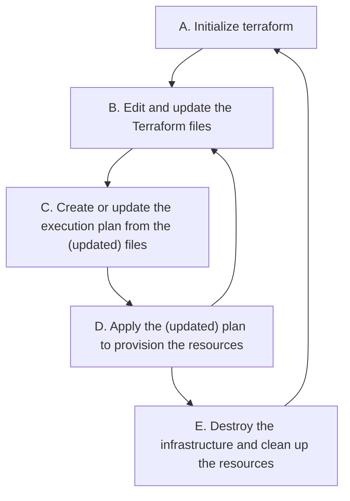

# How to Get Started

A typical workflow for using Terraform for provisioning and managing cloud resources involves the following stages:



## Initialize Terraform

```bash
terraform init
```

## Create an Execution Plan

```bash
terraform plan -out=plan.tfplan
```

## Apply the Plan

```bash
terraform apply -parallelism=4
```

## Destroy the Infrastructure

```bash
terraform destroy
```
